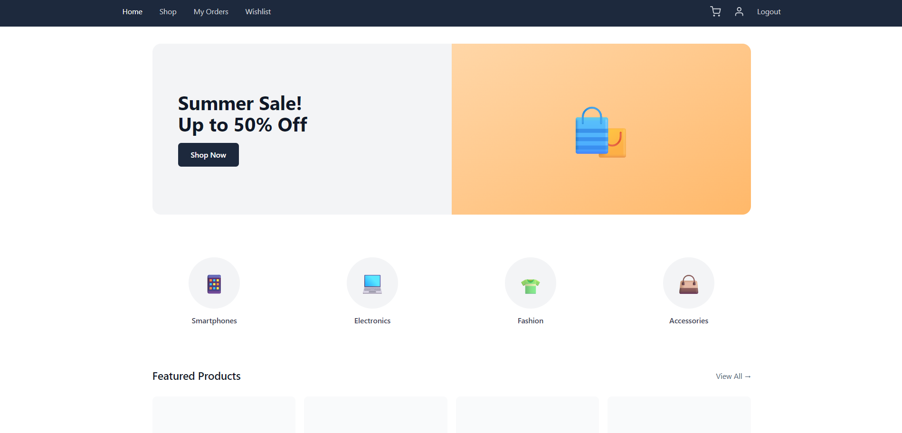
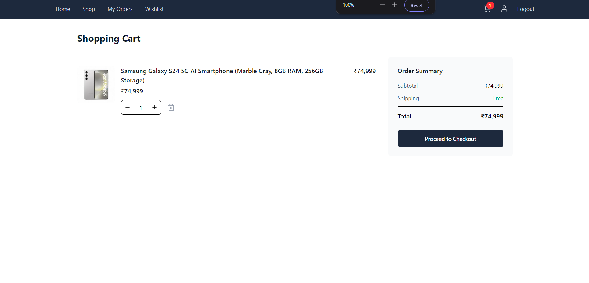
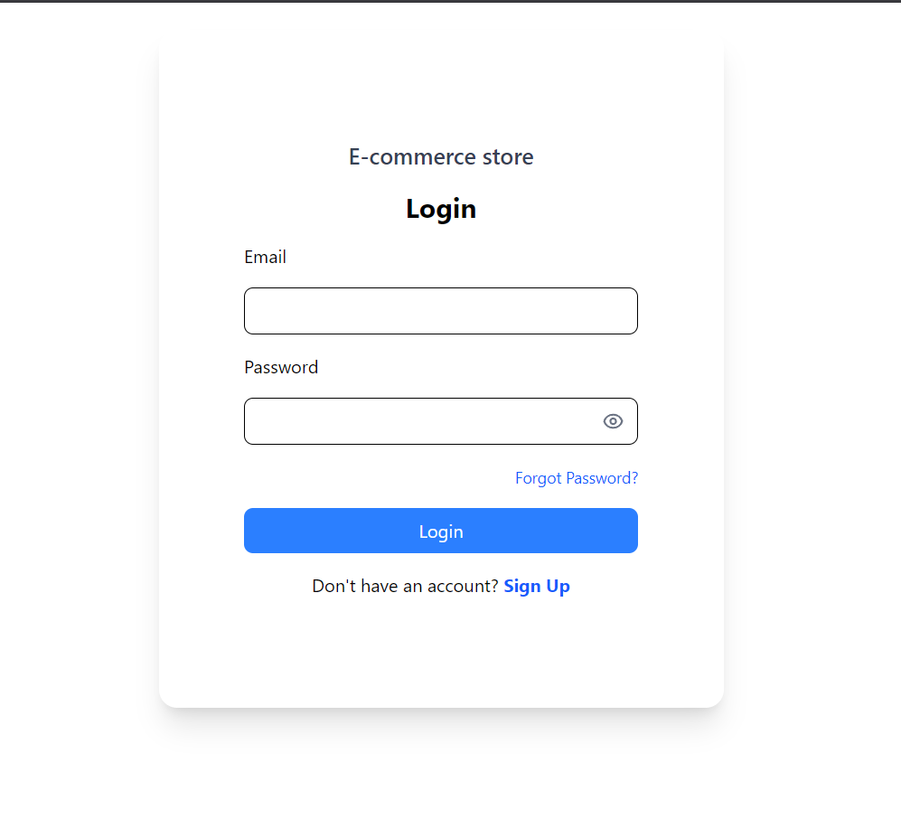

# ShopSphere - E-commerce Application

Welcome to **ShopSphere**, a modern and fully functional e-commerce platform built with the MERN stack (MongoDB, Express, React, Node.js). This application offers a seamless shopping experience with features like product browsing, user authentication, shopping cart management, and profile settings.

## 🚀 Features

-   **User Authentication**: Secure Sign Up and Login functionality.
-   **Product Catalog**: Browse a wide range of products with details.
-   **Shopping Cart**: Add, remove, and manage items in your cart.
-   **Wishlist**: Save your favorite items for later.
-   **User Profile**: Manage your account details and password.
-   **Responsive Design**: Optimized for both desktop and mobile devices.

## 🛠️ Tech Stack

-   **Frontend**: React, React Router, Tailwind CSS, Vite
-   **Backend**: Node.js, Express.js
-   **Database**: MongoDB
-   **Authentication**: JWT (JSON Web Tokens)
-   **Image Storage**: Cloudinary

## 📸 Screenshots

Here is a glimpse of the application:

### Home Page


### Product Details


### Shopping Cart


### Login Page


### Signup Page


## ⚙️ Installation & Run Instructions

Follow these steps to set up the project locally.

### Prerequisites

-   Node.js (v16+)
-   MongoDB (Local or Atlas)
-   Cloudinary Account

### 1. Clone the Repository

```bash
git clone <repository-url>
cd "Ecommerce App"
```

### 2. Backend Setup

Navigate to the backend directory and install dependencies:

```bash
cd backend
npm install
```

Create a `.env` file in the `backend` folder and add your environment variables:

```env
PORT=3000
MONGODB_URI=<your-mongodb-uri>
CORS_ORIGIN=*
ACCESS_TOKEN_SECRET=<your-access-token-secret>
ACCESS_TOKEN_EXPIRY=1d
REFRESH_TOKEN_SECRET=<your-refresh-token-secret>
REFRESH_TOKEN_EXPIRY=10d
CLOUDINARY_CLOUD_NAME=<your-cloud-name>
CLOUDINARY_API_KEY=<your-api-key>
CLOUDINARY_API_SECRET=<your-api-secret>
EMAIL_USER=<your-email-user>
EMAIL_PASS=<your-email-password>
```

Start the backend server:

```bash
npm run dev
```

### 3. Frontend Setup

Open a new terminal, navigate to the frontend directory, and install dependencies:

```bash
cd frontend/e-commerce
npm install
```

Start the frontend development server:

```bash
npm run dev
```

The application should now be running at `http://localhost:5173`.

## 🤝 Contributing

Contributions are welcome! Please feel free to submit a Pull Request.
